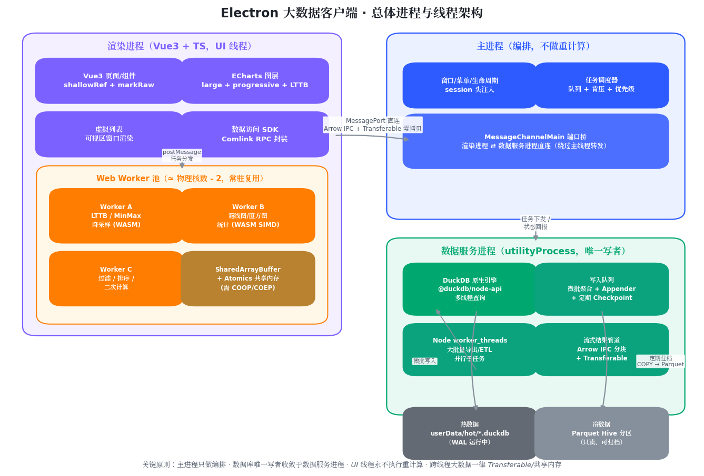

# Performance Demo — Electron 大数据存储与高性能计算验证工程

按《Electron大数据存储与高性能计算技术方案.md》（仓库根目录）落地的可运行工程：
Electron + Vue3 + TS + Node.js + DuckDB + WebWorker，覆盖方案第一、二阶段的核心链路。



## 架构落地对照

| 方案决策 | 落地位置 |
|---|---|
| DuckDB 部署于独立 utilityProcess（原生 @duckdb/node-api） | `src/data-service/`（构建为 `out/data-service/index.mjs`） |
| 主进程只做编排、建连时充当"接线员" | `src/main/`（窗口、宿主管理、MessageChannel 分发） |
| MessageChannel 渲染↔数据进程直连（查询/写入/订阅三通道） | `src/main/channelBroker.ts`、`src/preload/`、`src/renderer/src/sdk/portBridge.ts` |
| 全局唯一写者 + 微批聚合 + Appender + 背压 | `src/data-service/write/batchWriter.ts` |
| 热库 DuckDB + 冷数据 Hive 分区 Parquet + 统一视图 | `src/data-service/db/schema.ts`、`db/archive.ts` |
| SQL 下推（过滤/排序/箱线五数/直方图/异常点） | `src/data-service/query/sql.ts` |
| 流式分块 + Transferable 零拷贝 + credit 背压 + interrupt 取消 | `src/data-service/query/queryEngine.ts`、`src/shared/columnar.ts` |
| 预聚合金字塔 + 视口选层 + Worker MinMax→LTTB（≤ 像素×2） | `SignalChart.vue`、`src/renderer/src/workers/` |
| 箱线图 SQL 出统计 + 异常散点 + 框选联动 | `BoxplotPanel.vue` |
| 虚拟列表 + keyset 分页 | `VirtualTable.vue` |
| shallowRef/markRaw 响应式纪律 | 各组件（图表实例、窗口行集均浅持有） |
| 内存预算制 + 高水位自动重生 | `src/data-service/index.ts`（tick 上报）、`src/main/dataServiceHost.ts` |
| 数据进程内 worker_threads 池（重型子任务） | `src/data-service/workers/threadPool.ts`（归档 COPY 走线程池） |
| COOP/COEP 注入（按需解锁 SAB/WASM threads） | `src/main/index.ts`（`ENABLE_CROSS_ORIGIN_ISOLATION=1` 开启） |

## 快速开始

```bash
npm install        # 已钉版（避开 DuckDB 供应链投毒版本区间，见方案 §9）
npm run dev        # 构建 data-service 后启动 electron-vite 开发模式
npm run seed       # 可选：预灌 30 天 × 4 通道 ≈ 1037 万行历史数据
npm run typecheck  # 渲染端 + Node 端双侧类型检查
npm run build      # 产物输出到 out/
```

数据目录默认 `<工程根>/data`（热库 `data/hot/hot.duckdb`、归档 `data/archive/`），
可用环境变量 `DATA_DIR` 覆盖；`seed` 与数据服务进程读写同一目录。
启动后模拟数据源默认以 1 万行/秒写入（UI 可停/调速），写入 15s 后触发首次归档巡检。

## 验收路径

1. 不 seed 直接 `npm run dev`：实时曲线随模拟源滚动，顶部指标条显示写入速率/水位/内存。
2. `npm run seed` 后再 `npm run dev`：
   - 曲线点"全部范围"→ 自动选 L2 层，首屏亚秒；逐级放大自动穿透 L1/L0；
   - 箱线图按时间桶出五数与异常散点，框选箱体联动曲线下钻；
   - 明细表滚动即 keyset 分页，DOM 节点恒定；
   - 启动 15s 后早于 3 天的数据归档为 `data/archive/dt=YYYY-MM-DD/*.parquet`，
     历史查询穿透统一视图（分区裁剪生效）。

## 目录结构

```
src/
├── shared/            # 三端共享：协议、领域类型、列式二进制帧编解码
├── main/              # 主进程（只编排）：窗口、数据进程宿主、通道接线员
├── preload/           # contextBridge 最小桥接面
├── data-service/      # utilityProcess：DuckDB 独占进程
│   ├── db/            #   建库/视图/归档
│   ├── write/         #   微批写入管线（唯一写者）
│   ├── query/         #   SQL 下推与流式查询引擎
│   └── workers/       #   worker_threads 池
└── renderer/          # Vue3 渲染进程
    └── src/
        ├── sdk/       #   端口桥 / 查询 SDK（取消·去抖·LRU）/ 实时中枢
        ├── workers/   #   Worker 池 + MinMax→LTTB 降采样
        ├── stores/    #   Pinia（只放小状态）
        ├── components/#   SignalChart / BoxplotPanel / VirtualTable
        └── views/     #   Dashboard 总装
scripts/seed.mjs       # 历史数据灌注（与数据服务共用 schema.sql）
```

## 与方案的偏差说明

- **传输编码用自定义列式帧（`src/shared/columnar.ts`）而非 Arrow IPC**：
  `@duckdb/node-api` 当前未暴露引擎侧 Arrow IPC 序列化，Node 侧经 apache-arrow
  二次打包会多一次全量拷贝。自定义帧保持同等目标——列式布局 + TypedArray 视图；
  后续 DuckDB 暴露 Arrow IPC 后可单点替换编解码层，协议不变。
- **跨进程一跳是结构化克隆而非 Transferable 转移**：Electron 的 `MessagePortMain`
  其 transfer 列表仅接受端口对象（传 ArrayBuffer 会抛 `Port at index 0 is not a
  valid port`，本工程实测）。零拷贝链在渲染进程内部完整保留：SDK 解码为帧 buffer
  上的零拷贝视图，Worker 降采样输入/输出均走 Transferable。跨进程侧用 ~64k 行
  大帧 + credit 背压摊薄克隆开销；如需跨进程真零拷贝，演进方向是 SharedArrayBuffer
  环形队列（`ENABLE_CROSS_ORIGIN_ISOLATION=1` 已内置开关）。
- **数据目录默认 `./data` 而非 `userData/data`**：便于 seed 脚本与开发调试，
  设置 `DATA_DIR` 即切回任意位置。
- 第三阶段内容（Rust/WASM 降采样核、WASM threads、打包分发）未实现，预留扩展点。

## 关键配置（环境变量）

| 变量 | 默认 | 说明 |
|---|---|---|
| `DATA_DIR` | `./data` | 数据根目录 |
| `DB_MEMORY_LIMIT` | `1536MB` | DuckDB 内存预算（超出自动落盘） |
| `FLUSH_ROWS` / `FLUSH_MS` | `50000` / `500` | 微批触发阈值（先到先触发） |
| `HOT_RETENTION_MS` | 3 天 | 热表保留窗口，之外归档 Parquet |
| `SIM_RATE` / `SIM_CHANNELS` | `10000` / `4` | 模拟源速率（行/秒）与通道数 |
| `DS_HIGH_WATER_MB` | `2048` | 数据进程 rss 高水位（触发排空重生） |
| `ENABLE_CROSS_ORIGIN_ISOLATION` | 关 | 置 `1` 注入 COOP/COEP（解锁 SAB） |

## 运维注意

- **若本机全局设置了 `ELECTRON_RUN_AS_NODE=1`**（部分 Node 工具链会设置）：它会让 Electron 退化为纯 Node，应用无法启动。`npm run dev` 已用 `scripts/dev.mjs` 启动器自动清除该变量，无需手动处理。
- 升级 Electron 后若 DuckDB 原生模块加载失败，执行 `npx electron-rebuild -f -w @duckdb/node-bindings`（`@electron/rebuild` 已在 devDependencies）。
- npm 依赖全部精确钉版；升级任何依赖前对照方案 §9 风险清单（供应链投毒、旧 `duckdb` 包废弃等）。
